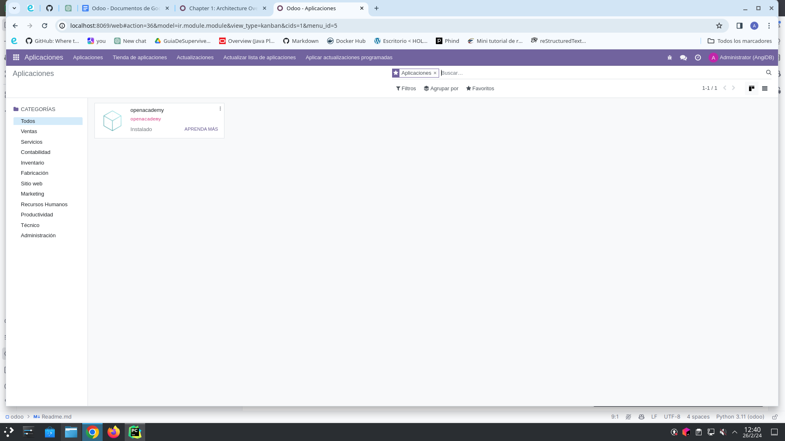
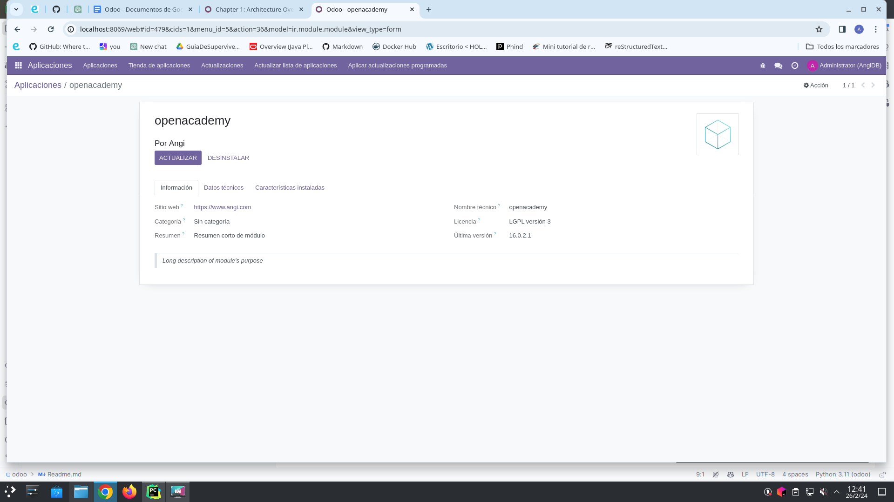
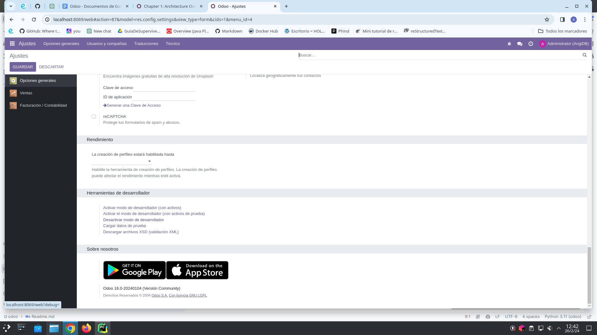
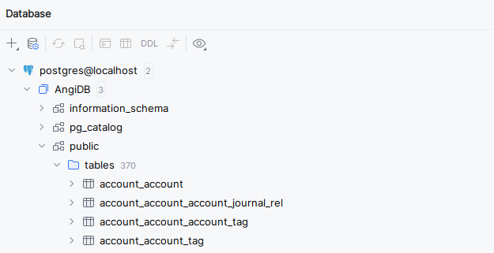
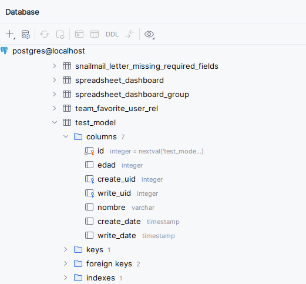
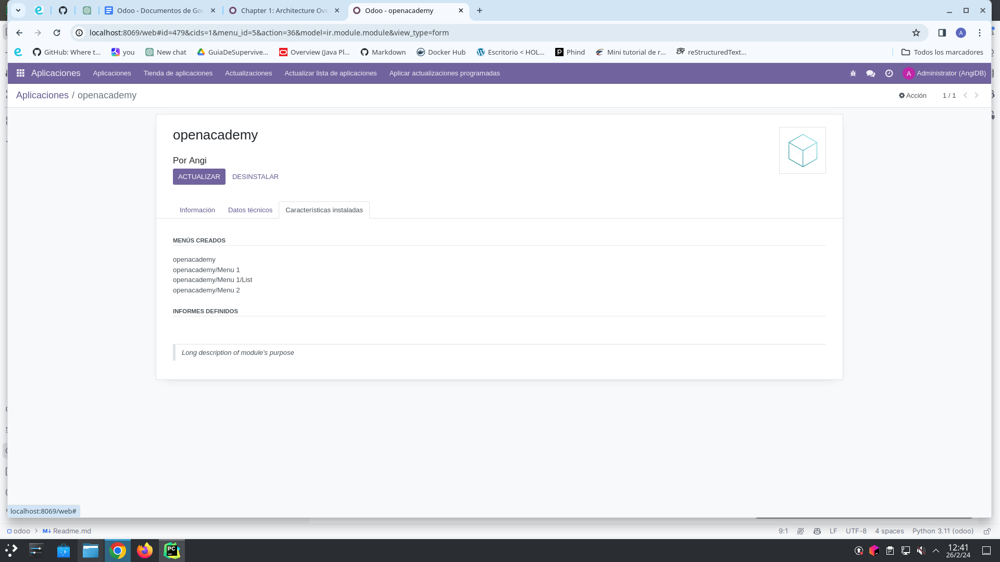
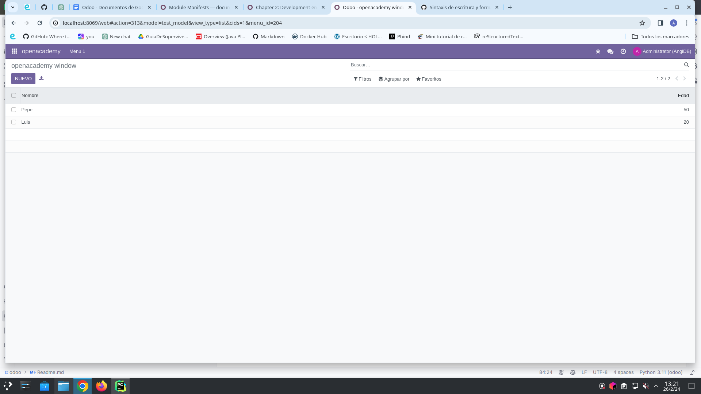
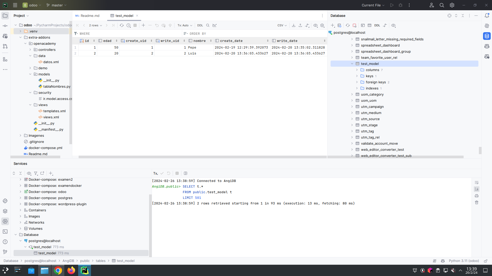

# Desarrollo de "addon" en Odoo

-----------------
## Descripción
Odoo sigue una arquitectura multicapa , lo que significa que la presentación, la lógica empresarial y el almacenamiento de datos están separados. Más concretamente, utiliza una arquitectura de tres niveles, que consta de una capa de presentación, una capa de lógica empresarial y una capa de almacenamiento de datos.

## Instalación y Configuración de Odoo
Para instalar Odoo, necesitamos lanzar un contenedor de Docker con la imagen de Odoo.
Con el siguiente [docker-compose.yml](./docker-compose.yml)

```
services:
  web_dev:
    image: odoo:16.0
    depends_on:
      - db
    ports:
      - "8069:8069"
    volumes:
      - ./extra-addons:/mnt/extra-addons
```
Esta sección define el servicio web_dev. Aquí están los detalles:

`image: odoo:16.0`: Indica que este servicio utilizará la imagen de Docker llamada "odoo" con la etiqueta "16.0". Específicamente, la versión 16.0 de Odoo.

`depends_on: - db`: Especifica que este servicio depende del servicio llamado "db". Esto asegura que el servicio de base de datos se inicia antes de que se inicie el servicio de Odoo.

`ports: - "8069:8069"`: Mapea el puerto 8069 del host al puerto 8069 del contenedor de Odoo. Esto significa que puedes acceder a Odoo en tu máquina local a través del puerto 8069.

`volumes: - ./extra-addons:/mnt/extra-addons`: Mapea el directorio local ./extra-addons al directorio /mnt/extra-addons dentro del contenedor de Odoo. **Esto se utiliza para agregar módulos adicionales a Odoo.**

## Crear un módulo en Odoo
Creamos la plantilla con $odoo scaffold openacademy. 
Luego, creamos el archivo __manifest__.py con la información del módulo.

> [!WARNING]
> Por cada modificación de código tenemos que reiniciar el servidor Odoo. Si no hacemos esto, tenemos que desinstalar e instalar el módulo para que actualize los cambios. 
> Es conveniente usar el campo ‘version’ del manifest para asegurarnos de que cargamos la nueva version con las modificaciones.

```python
{
    'name': "openacademy",

    'summary': """
        Resumen corto de módulo""",

    'description': """
        Long description of module's purpose
    """,

    'author': "Angi",
    'website': "https://www.angi.com",

    # Categories can be used to filter modules in modules listing
    # Check https://github.com/odoo/odoo/blob/16.0/odoo/addons/base/data/ir_module_category_data.xml
    # for the full list
    'category': 'Uncategorized',
    'version': '2.1',

    # any module necessary for this one to work correctly
    'depends': ['base'],

    # always loaded
    'data': [
        'security/ir.model.access.csv',
        'views/views.xml',
        'views/templates.xml',
        'data/datos.xml',
    ],
    # only loaded in demonstration mode
    'demo': [
        'demo/demo.xml',
    ],
}
```
> [!IMPORTANT]
> En Ajustes Generales ponemos el odoo en modo desarrollador.
> Para que salga la opción tenemos que activar cualquier App antes.







> [!NOTE]
> Para evitar problemas de permisos, es recomendable ejecutar el contenedor con el usuario root, sino no podremos modificar los archivos del contenedor.
> 
> Ejecutar: **$ docker exec -u root -it OdooDev /bin/bash** para entrar en la terminal del contenedor como usuario root.
> 
> Entrar en el directorio mnt/extra-addons y ejecutar **chmod -R 777 openacademy/** para asegurar que todos sus archivos sean accesibles 
> y modificables por todos los usuarios del contenedor.

## Crear un modelo en Odoo
Editamos el archivo [models/tablaNombres.py](./extra-addons/openacademy/models/tablaNombres.py) con la información del modelo.

> [!IMPORTANT]
> Recuerda que si haces un modelo nuevo debes importarlo en el archivo [__init__.py](./extra-addons/openacademy/models/__init__.py)

## Crear una vista en Odoo
Editamos el archivo [views/views.xml](./extra-addons/openacademy/views/views.xml) con la información de la vista.
En este archivo se define la vista de la tabla creada en el modelo.

## Acceso a la base de datos
Para acceder a la base de datos de Odoo, podemos hacerlo a través del IDE de Python.




> [!NOTE]
> El nombre de la tabla en la base de datos de Odoo será el nombre del modelo en minúsculas y con guiones bajos en lugar de espacios.
> En este caso se llama test_model.

## Crear un menú en Odoo
Editamos el archivo [views/views.xml](./extra-addons/openacademy/views/views.xml) con la información del menú.
En este archivo se define el menú de la tabla creada en el modelo.
```
 <!-- Top menu item -->

    <menuitem name="openacademy" id="openacademy.menu_root"/>

    <!-- menu categories -->

    <menuitem name="Menu 1" id="openacademy.menu_1" parent="openacademy.menu_root"/>
    <menuitem name="Menu 2" id="openacademy.menu_2" parent="openacademy.menu_root"/>

    <!-- actions -->

    <menuitem name="List" id="openacademy.menu_1_list" parent="openacademy.menu_1"
              action="openacademy.action_window"/>
```
> [!IMPORTANT]
> Hay que editar el archivo [ir.model.access.csv](./extra-addons/openacademy/security/ir.model.access.csv) para dar permisos a los usuarios para acceder a la tabla.



# Crear un registro en Odoo
Editamos el archivo [data/datos.xml](./extra-addons/openacademy/data/datos.xml) con la información del registro.
En este archivo se define el registro de la tabla creada en el modelo, con los campos que se van a mostrar en la vista.

También se puede hacer desde la interfaz de Odoo.


